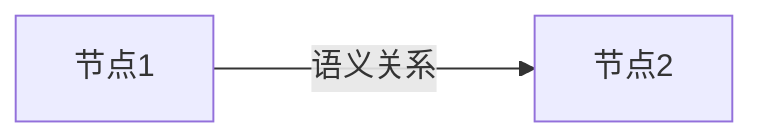

## 产生式表示法

> 专家系统基本的知识表示方法；适合表示事实性知识和规则性知识；容易描述事实、规则以及它们的不确定性度量

**事实的概念**：陈述句

- 断言语言变量的值："雪是白的"
- 断言语言变量之间的关系："汪峰热爱祖国"

**事实的表示**：

- 确定性知识
  - （对象，属性，值），如（雪，颜色，白）
  - （关系，对象1，对象2），如（热爱，汪峰，祖国）
- 非确定性知识
  - （对象，属性，值，可信度因子），可信度因子为[0,1]之间的一个实数

**规则的表示**：

- 规则的产生式表示形式常称为产生式规则，简称产生式或规则

- 产生式的基本形式：$P\rightarrow Q$ 或者 $IF P THEN Q$；其中P是前提、前件，Q是结论、后件

**知识的产生式表示方法**：

graph TD
A[知识];
B1[规则性知识];
B2[事实性知识];
C1[确定性];
C2[不确定性];
C3[确定性];
C4[不确定性];
D1["P->Q或者IF P THEN Q"];
D2["P->Q(CF)或者IF P THEN Q(CF)"];
D3["(对象，属性，值)或者(关系，对象1，对象2)"];
D4["(对象，属性，值，可信度值)或者(关系，对象1，对象2，可信度值)"];
A--->B1--->C1--->D1;
A--->B2--->C3--->D3;
B1--->C2--->D2;
B2--->C4--->D4;
<\div>

**产生式系统的基本结构**：

graph LR
A["规则库"] ---> B["控制系统"] ---> C["综合数据库"];
C["综合数据库"] ---> B["控制系统"] ---> A["规则库"];
<\div>

- 综合数据库DB（Data Base）：
  - 存放推理过程的各种当前信息
  - 作为推理过程选择可用规则的依据
- 规则库RB（Rule Base）：也称知识库KB（Knowledge Base）
  - 存放推理所需要的所有规则
  - 知识的完整性、一致性、准确性、灵活性和可组织性

**产生式系统的运行过程**：

- Step1：外部输入的初始事实放入综合数据库，转Step2
- Step2：从规则库中取一条规则，将其前提同当前综合数据库中的事实/数据进行模式匹配，转Step3
- Step3：匹配成功则转Step4，匹配失败则转Step2
- Step4：把该规则的结论放入当前综合数据库，或执行规则所规定的动作

> 例1：猴子摘香蕉
>
> - 综合数据库 (M,B,Box,On,H)
>   - M是猴子的位置
>   - B是香蕉的位置
>   - Box是箱子的位置
>   - On=0表示猴子在地板上，On=1表示猴子在箱子上
>   - H=0表示猴子没有抓到香蕉，H=1表示猴子抓到了香蕉
> - 初始状态 (a,c,b,0,0)
> - 结束状态 (c,c,c,1,1)
> - 规则集
>   - r1：IF(x,y,z,0,0) Then(w,y,z,0,0) 猴子移动
>   - r2：IF(x,y,x,0,0) Then(z,y,z,0,0) 猴子推箱子
>   - r3：IF(x,y,x,0,0) Then(x,y,x,1,0) 猴子爬箱子
>   - r4：IF(x,y,x,1,0) Then(x,y,x,0,0) 猴子下箱子
>   - r5：IF(x,x,x,1,0) Then (x,x,x,1,1) 猴子抓香蕉
>   - 其中，x，y，z，w是变量
> - 解答
>   - 根据具体问题可将规则具体为
>   - r1：IF(a,c,b,0,0) Then(b,c,b,0,0) 
>   - r2：IF(b,c,b,0,0) Then(c,c,c,0,0)
>   - r3：IF(c,c,c,0,0) Then(c,c,c,1,0)
>   - r5：IF(c,c,c,1,0) Then(c,c,c,1,1)
>   - 在已知事实下，$r_1\rightarrow r_2\rightarrow r_3\rightarrow r_5$可得到香蕉

> 例2：传教士与野人过河问题
>
> - N个传教士，N个野人，一条船，船上可坐k个人，至少要有一个人开船；当两岸上传教士和野人同时在时，需要传教士不少于野人
> - 综合数据库：(m,c,b)，$0\le m\le3,0\le c\le3,b\in \{0,1\}$
> - 初始状态(3,3,1)，目标状态(0,0,0)
> - 规则集（略）：从左岸到右岸或从右岸到左岸1个m,1个c,2个m,2个c,或是1个m和1个c，共10个规则

**产生式系统的特点**：

- 优点：
  - 自然性：采用“如果...，则...”的形式
  - 模块性：规则不能相互调用，只能通过综合数据库发生联系
  - 有效性：确定性&不确定性知识都可表示
- 缺点：
  - 效率低：求解过程是反复进行的"匹配-冲突消解-执行"过程
  - 不便于表示结构性知识：由于模块性所导致，规则不能相互调用

---

## 语义网络表示法

**语义网络**：

- 通过概念及语义关系来表示知识的一种网络图，是一个带标注的有向图
- 结点表示各种概念、事物、对象、行为、状态
- 有向弧表示节点间的联系或关系

**语义网络的基本表示**：

- 语义基元：最基本的语义单元
- （节点1，弧，节点2）

- 基本网元

- 把多个基本网元用相应的语义联系关联在一起，就可得到一个语义网络
- 语义网络中的节点还可以是一个语义自网络，所以，语义网络实质上是一种多层次的嵌套结构

**基本语义关系**：

- 实例关系：ISA，“是一个”
- 分类关系：AKO，“是一种”
- 成员关系：A-Member-of，“是一员”

> 上述三种具有的一个最主要的特征是属性的继承性

- 聚类关系：Part-of，“是一部分”
  - 聚类关系一般不具有属性的继承性
- 属性关系：Have、Can
- 时间关系：Before、After
- 位置关系：Located-on、Located-under、Located-at、Located-inside、Located-outside
- 相近关系：Similar-to，“相似”；Near-to，“接近”

**事物和概念的表示**：

- 一元关系：节点1表示实体，节点2表示实体的性质或属性，弧表示语义关系
- 二元关系：单个基本网元
- 多元关系：语义网络

> 可按照需求添加抽象概念来形成语义网络

**情况的表示**：

- 以“小燕子从春天到秋天占有一个巢”为例，需要添加一个`占有权`节点，表示占有物和占有时间，`占有权` --AKO--->`占有资格` --AKO---> `情况`

**事件和动作的表示**：

- 设立一个事件节点或动作节点。其中，事件节点由一些向外引出的弧来指出事件行为及发出者与接收者。动作节点由一些向外引出的弧来指出动作的主体与客体。

**基于语义网络的推理**：

- 继承
  - 通常是沿着ISA、AKO等弧进行的
- 匹配
  - 在知识库的语义网络中寻找与待求解问题相符的语义网络模式

**语义网络表示法的特点**：

- 优点：
  - 结构性
  - 联想性
  - 自索引性
- 缺点
  - 非严格性
  - 复杂性
